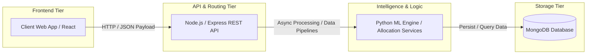

# A D S ABHISHEK — AI/ML & Software Engineering Portfolio

<div align="center">


<p align="center">
  <b>Computer Science Student | AI/ML & Software Engineering Enthusiast</b><br>
  <i>"I build to understand." — Turning real-world problems into scalable, usable software solutions.</i>
</p>

[Live Demo](https://ads-abhishek.vercel.app) • [Case Studies](#-featured-case-studies) • [Interactive Terminal](#-interactive-terminal-cli) • [AI Assistant](#-local-recruiter-ai-assistant) • [Contact](#-connect-with-me)

</div>

---

## ⚡ Overview

This repository contains the source code for my personal engineering portfolio, designed with an **"AI Engineering Command Center"** aesthetic. It showcases end-to-end full-stack architectures, machine learning pipelines, system designs, and verifiable software implementations.

### 🎯 Key Highlights
- **Institution**: VIT Chennai — B.Tech Computer Science Engineering (2024–2028)
- **Academic Standing**: **8.30 / 10 CGPA**
- **Domain Focus**: AI/ML, Software Engineering, Full-Stack Systems & Applied Data Science
- **Honors**: 🏆 Winner — Ideathon (Quality Education) | 🏅 NPTEL Top 1% Performer

---

## 🛠️ Technical Arsenal

| Category | Technologies & Tools |
| :--- | :--- |
| **Languages** | Java, Python, JavaScript (ES6+), TypeScript, HTML5, CSS3 |
| **Core CS** | Data Structures & Algorithms, Object-Oriented Programming (OOP), DBMS, Computer Networks |
| **Frontend** | React.js, Next.js (App Router), Tailwind CSS, Framer Motion |
| **Backend & DB** | Node.js, Express.js, RESTful APIs, MongoDB, Mongoose ODM |
| **Machine Learning** | Scikit-learn, Pandas, NumPy, Data Preprocessing, Supervised & Unsupervised Modeling |
| **Data Visualization**| Matplotlib, Seaborn |
| **Tooling & DevOps** | Git, GitHub, Postman, VS Code, Vercel |

---

## 🚀 Featured Case Studies



### 1. [SmartGap AI](https://github.com/addadugurudurga2024-lang/IdeaThon-Decoders)
- **Category**: AI / Education / Full Stack
- **Recognition**: 🏆 **1st Place Winner — Ideathon**
- **Description**: AI-powered educational platform designed to improve student–teacher communication and academic assistance through intelligent recommendation workflows.
- **Stack**: Python, AI/ML, React, Node.js, MongoDB

### 2. SmartParking System
- **Category**: Full Stack / Intelligent Systems
- **Description**: Real-time parking slot allocation engine utilizing proximity algorithms and atomic concurrency guards in MongoDB to prevent double-booking.
- **Stack**: MERN Stack (React, Node.js, Express, MongoDB)

### 3. Project Management & Issue Tracker
- **Category**: Full Stack / Backend Systems
- **Description**: Scalable task assignment and issue tracking platform with strict schema validation, deterministic state machine transitions, and Postman test verification.
- **Stack**: React, Node.js, Express, MongoDB, Postman

### 4. Applied Machine Learning Pipelines
- **[Heart Disease Prediction](https://github.com/addadugurudurga2024-lang/codealpha_task1_Heart_Disease_Prediction)**: Supervised classification pipeline evaluating clinical indicators (BP, cholesterol, ECG) with Scikit-learn and Seaborn.
- **[Credit Scoring Model](https://github.com/addadugurudurga2024-lang/codealpha_task2_Credit_Scoring_Prediction)**: Risk assessment classifier analyzing debt ratios and financial distributions.
- **[Handwritten Character Recognition](https://github.com/addadugurudurga2024-lang/codealpha_task3_Handwritten_Character_Recognition)**: Computer vision pipeline performing pixel-matrix normalization and multi-class character recognition.

---

## 💻 Interactive Features

### 🖥️ Interactive Terminal (CLI)
Embedded in-browser terminal emulator (`ADS@portfolio:~$`) supporting keyboard navigation, command history, and instant commands:
```bash
ADS@portfolio:~$ help
ADS@portfolio:~$ skills
ADS@portfolio:~$ projects
ADS@portfolio:~$ education
ADS@portfolio:~$ contact
```

### 🤖 Local Recruiter AI Assistant
Deterministic, zero-hallucination portfolio question-answering assistant running entirely on the client side without external paid API dependencies.

### 📄 Curriculum Vitae Viewer
Full-screen printable and copyable CV viewer modal supporting instant print (`window.print()`), Markdown copy, and section inspections.

---

## 📂 Project Structure

```
├── app/
│   ├── layout.tsx              # Root layout, Google fonts, custom cursor
│   ├── page.tsx                # Main single-page command center
│   ├── globals.css             # Design tokens, cyber grid, glassmorphism
│   ├── robots.ts               # Search engine crawler configuration
│   └── sitemap.ts              # Automatic SEO sitemap generator
├── components/
│   ├── assistant/              # Deterministic Recruiter AI Assistant
│   ├── hero/                   # Hero section, terminal snippet, particle canvas
│   ├── navbar/                 # Sticky glass navigation & mobile menu
│   ├── projects/               # Filterable gallery, case study modal & architecture visualizer
│   ├── resume/                 # Formatted CV preview modal
│   ├── sections/               # About, Focus, Skills, Education, Achievements, Contact, Footer
│   ├── terminal/               # Interactive bash terminal simulator
│   └── ui/                     # Badges, glow cards, custom cursor, section headers
├── data/
│   ├── portfolioData.ts        # Centralized single source of truth (personal info, skills)
│   └── projectsData.ts         # Comprehensive case studies, architecture flows, code snippets
├── lib/
│   ├── assistantEngine.ts      # Semantic query matching logic for AI assistant
│   └── utils.ts                # Class merging & formatting helpers
└── public/                     # Static public assets
```

---

## 🚦 Getting Started

### Prerequisites
- Node.js `v18.0+` or `v20.0+`
- npm / yarn / pnpm

### Installation

1. Clone the repository:
   ```bash
   git clone https://github.com/addadugurudurga2024-lang/Portfolio.git
   cd Portfolio
   ```

2. Install dependencies:
   ```bash
   npm install
   ```

3. Launch the development server:
   ```bash
   npm run dev
   ```
   Open [http://localhost:3000](http://localhost:3000) in your browser.

4. Build for production:
   ```bash
   npm run build
   ```

---

## 📬 Connect with Me

- 📧 **Email**: [addaduguru.durga2024@vitstudent.ac.in](mailto:addaduguru.durga2024@vitstudent.ac.in)
- 📱 **Phone**: [+91 6303731166](tel:6303731166)
- 💼 **LinkedIn**: [a-d-sai-abhishek-a589153ab](https://www.linkedin.com/in/a-d-sai-abhishek-a589153ab)
- 🐙 **GitHub**: [addadugurudurga2024-lang](https://github.com/addadugurudurga2024-lang)
- 💻 **LeetCode**: [durgasaiabhishek](https://leetcode.com/u/durgasaiabhishek/)
- 📍 **Location**: Rajahmundry, Andhra Pradesh, India

---

<div align="center">
  <sub>Designed & Developed by <b>A D S ABHISHEK</b> © 2026. Built with Next.js, TypeScript & Tailwind CSS.</sub>
</div>
